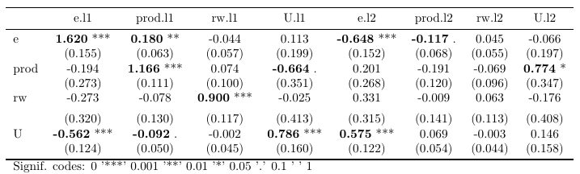
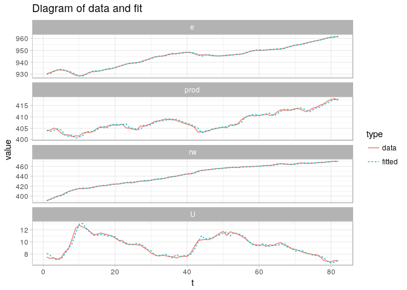
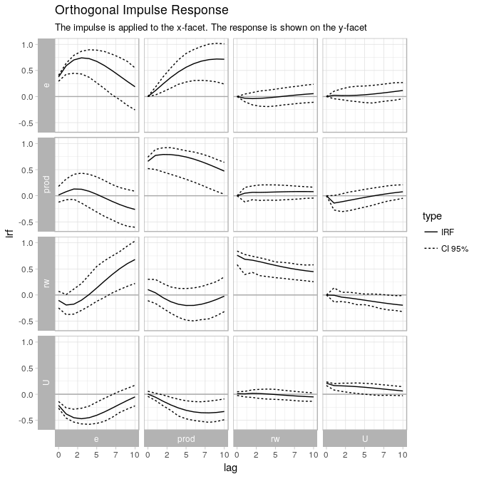

<!-- README.md is generated from README.Rmd. Please edit that file -->

# varsExtra

The goal of varsExtra is to make it easier to export vars-results.

## Installation

You can install the development version of varsExtra with:

``` r
install.packages("devtools")
devtools::install_github("DavZim/varsExtra")
```

## Example

This is a basic example which shows you how to solve a common problem:

``` r
library(varsExtra)
library(vars)
#> Loading required package: MASS
#> Loading required package: strucchange
#> Loading required package: zoo
#> 
#> Attaching package: 'zoo'
#> The following objects are masked from 'package:base':
#> 
#>     as.Date, as.Date.numeric
#> Loading required package: sandwich
#> Loading required package: urca
#> Loading required package: lmtest
library(ggplot2)
# set a theme for all plots
theme_set(theme_light())

# load some example data and perform a VAR
data(Canada)

# calculate the VAR
varres <- VAR(Canada, lag = 2, type = "none")

# calculate an Impulse Resonse Function
irfres <- irf(varres)
```

# Flatten the Results into a table

``` r
flatten_var(varres)
#> $est
#>    var       e.l1     prod.l1        rw.l1        U.l1       e.l2
#> 1    e  1.6204676  0.17973134 -0.044255918  0.11310425 -0.6481516
#> 2 prod -0.1938905  1.16559603  0.074266483 -0.66412399  0.2014169
#> 3   rw -0.2730367 -0.07804660  0.900047886 -0.02480889  0.3312644
#> 4    U -0.5617918 -0.09173925 -0.001960487  0.78563864  0.5749261
#>        prod.l2        rw.l2        U.l2
#> 1 -0.116832697  0.044755373 -0.06581206
#> 2 -0.190894497 -0.069048046  0.77427171
#> 3 -0.008858991  0.062587364 -0.17579589
#> 4  0.068715871 -0.002926763  0.14585293
#> 
#> $se
#>    var      e.l1    prod.l1      rw.l1      U.l1      e.l2    prod.l2
#> 1    e 0.1548388 0.06295812 0.05652496 0.1994729 0.1520759 0.06797209
#> 2 prod 0.2726483 0.11085999 0.09953213 0.3512424 0.2677832 0.11968884
#> 3   rw 0.3202429 0.13021214 0.11690684 0.4125566 0.3145285 0.14058219
#> 4    U 0.1238638 0.05036354 0.04521731 0.1595689 0.1216535 0.05437448
#>        rw.l2      U.l2
#> 1 0.05472427 0.1972490
#> 2 0.09636139 0.3473265
#> 3 0.11318260 0.4079571
#> 4 0.04377684 0.1577899
#> 
#> $p_value
#>    var         e.l1      prod.l1        rw.l1         U.l1         e.l2
#> 1    e 3.011899e-16 5.584192e-03 4.361581e-01 5.724195e-01 5.893211e-05
#> 2 prod 4.792344e-01 2.449158e-16 4.579371e-01 6.256777e-02 4.543383e-01
#> 3   rw 3.966364e-01 5.507500e-01 4.798831e-11 9.522106e-01 2.956719e-01
#> 4    U 2.172592e-05 7.256611e-02 9.655337e-01 5.017450e-06 1.065780e-05
#>      prod.l2     rw.l2       U.l2
#> 1 0.08982575 0.4160775 0.73958759
#> 2 0.11499182 0.4759054 0.02883364
#> 3 0.94992331 0.5819460 0.66778097
#> 4 0.21028558 0.9468763 0.35830923
```

`varsExtra` allows you to export the results in table as well as plot
format. An easy export would look like this:

``` r
plot1 <- ggfy(varres)
ggsave("myplot.pdf", plot1)

table1 <- tabulize(varres, format = "latex")
writeLines(table1, "mytable.tex")
```

# Tables

``` r
var_table <- tabulize(varres, format = "latex")
print(var_table)
#> 
#> \begin{tabular}{lcccccccc}
#> \toprule
#>  & e.l1 & prod.l1 & rw.l1 & U.l1 & e.l2 & prod.l2 & rw.l2 & U.l2\\
#> \midrule
#> e & \textbf{1.620} *** & \textbf{0.180} ** & -0.044 & 0.113 & \textbf{-0.648} *** & \textbf{-0.117} . & 0.045 & -0.066\\
#>  & (0.155) & (0.063) & (0.057) & (0.199) & (0.152) & (0.068) & (0.055) & (0.197)\\
#> prod & -0.194 & \textbf{1.166} *** & 0.074 & \textbf{-0.664} . & 0.201 & -0.191 & -0.069 & \textbf{0.774} *\\
#>  & (0.273) & (0.111) & (0.100) & (0.351) & (0.268) & (0.120) & (0.096) & (0.347)\\
#> rw & -0.273 & -0.078 & \textbf{0.900} *** & -0.025 & 0.331 & -0.009 & 0.063 & -0.176\\
#> \addlinespace
#>  & (0.320) & (0.130) & (0.117) & (0.413) & (0.315) & (0.141) & (0.113) & (0.408)\\
#> U & \textbf{-0.562} *** & \textbf{-0.092} . & -0.002 & \textbf{0.786} *** & \textbf{0.575} *** & 0.069 & -0.003 & 0.146\\
#>  & (0.124) & (0.050) & (0.045) & (0.160) & (0.122) & (0.054) & (0.044) & (0.158)\\
#> \bottomrule
#> \multicolumn{9}{l}{Signif. codes: 0 '***' 0.001 '**' 0.01 '*' 0.05 '.' 0.1 ' ' 1}\\
#> \end{tabular}
```

which, when rendered looks like this 

# Plots

## Plot a VAR result

``` r
ggfy(varres)
```



## Plot an Impules-Response Function

``` r
ggfy(irfres)
```



# Additionals

Many functions have additional functionality, see the help-files for
more information.

If you want need more functionality, or find a bug, you are more than
welcome to open an issue or open a pull request.
